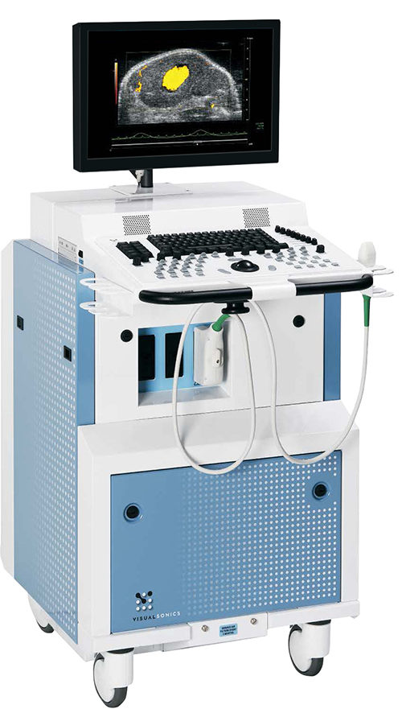
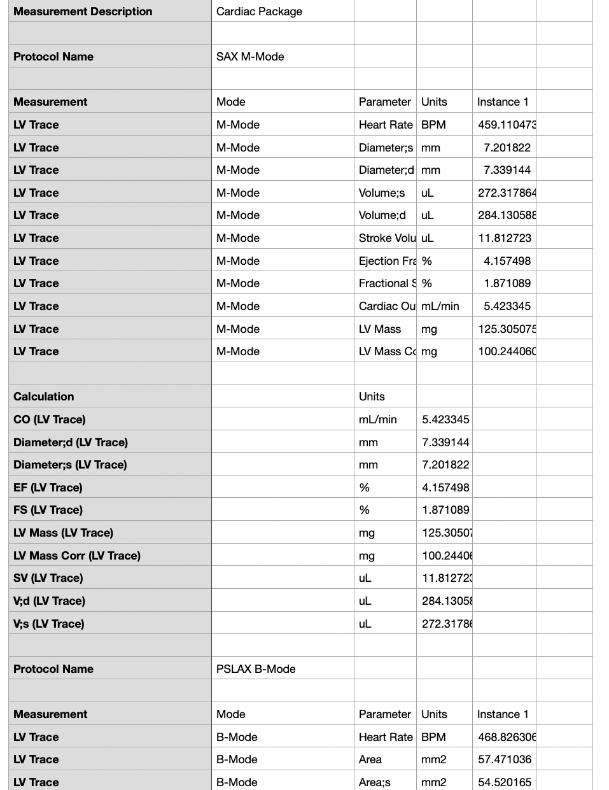

# Echo data extraction 
{width=20% height=40% align="right"}

## Overview

This is a web app to automate the ETL process of echo data for further statistical analysis. The raw data was generate from Visualsonic Vevo2100 ultrasound system(as shown on the right). 

## Raw data

As shown below, the raw data is not [tidy data](https://cran.r-project.org/web/packages/tidyr/vignettes/tidy-data.html)

{width=30% height=30%}

## Tidy data

The raw csv data can be upload and processed. The final tidy data can be viewed and downloaded.

